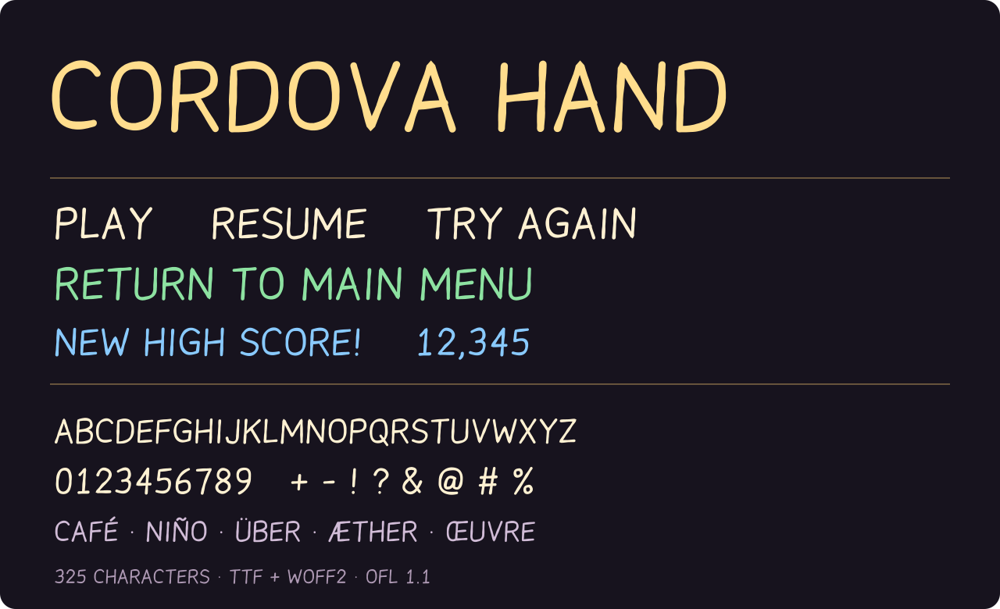
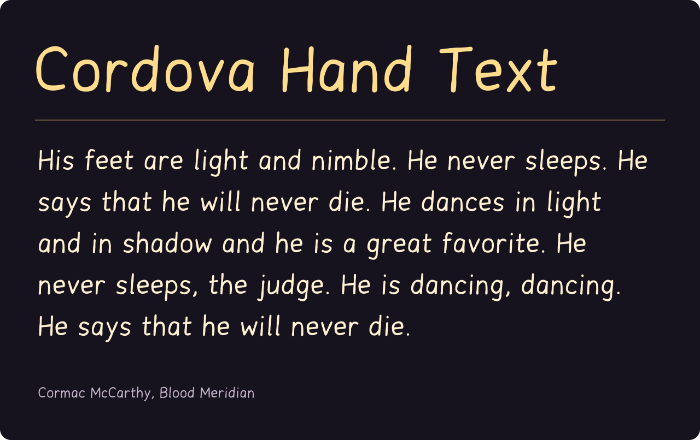

# Cordova Hand

A handwritten font with irregular strokes, proportional letters, and tabular numerals. Two editions are included: **Cordova Hand Text** with uppercase and lowercase, and **Cordova Hand** with capitals-only lettering. Both ship as TTF and WOFF2.

I made this font for use in retro/2000s-style video games.





## Download

- **[CordovaHandText-Regular.ttf](fonts/ttf/CordovaHandText-Regular.ttf)** and **[WOFF2](fonts/woff2/CordovaHandText-Regular.woff2)** — mixed-case edition with the original lowercase letters.
- **[CordovaHand-Regular.ttf](fonts/ttf/CordovaHand-Regular.ttf)** — installable TrueType font for desktop apps, iOS, design tools, and game engines.
- **[CordovaHand-Regular.woff2](fonts/woff2/CordovaHand-Regular.woff2)** — compressed webfont for websites and browser games.
- **[Latest release](https://github.com/andrew-dougie/cordova-hand/releases/latest)** — packaged downloads with the license and examples.

On macOS, open the TTF in Font Book and select **Install**. On Windows, right-click the TTF and select **Install**. Choose **Cordova Hand Text** for uppercase and lowercase, or **Cordova Hand** for capitals only.

## Font details

The letterforms have a slight forward lean, open counters, and 76-unit strokes in a 1,000-unit em.

**Cordova Hand Text** retains the original lowercase shapes, their shorter x-height, descenders, spacing, and kerning.

**Cordova Hand** is the capitals-only edition: typing lowercase Latin letters displays the matching capitals, including supported accented letters. The text itself is unchanged, so names, copied text, localization strings, and screen-reader labels keep their original spelling. The sharp-s character (`ß`) displays as `SS`.

The font contains vector outlines. Pixelation, colors, shadows, and animation are applied by the host application.

| Detail | Included |
| --- | --- |
| Families | Cordova Hand Text; Cordova Hand |
| PostScript names | `CordovaHandText-Regular`; `CordovaHand-Regular` |
| Package release | 1.003 |
| Weight | 450 |
| Characters | 325 mapped code points |
| Numerals | Tabular 0–9 |
| Spacing | Proportional letters; 23 mixed-case or 21 capital kerning pairs |
| Coverage | Printable ASCII, Latin-1, and selected Latin Extended-A letters |
| Formats | TTF and WOFF2 |

See the complete [character map](fonts/characters.json). Unsupported scripts require a fallback font.

## Install with a coding assistant

Copy this prompt into your coding assistant:

```text
Install Cordova Hand in this project using its existing framework and typography conventions.

Download and bundle these files from release v1.003:
- Mixed-case TTF: https://github.com/andrew-dougie/cordova-hand/releases/download/v1.003/CordovaHandText-Regular.ttf
- Mixed-case WOFF2: https://github.com/andrew-dougie/cordova-hand/releases/download/v1.003/CordovaHandText-Regular.woff2
- Capitals-only TTF: https://github.com/andrew-dougie/cordova-hand/releases/download/v1.003/CordovaHand-Regular.ttf
- Capitals-only WOFF2: https://github.com/andrew-dougie/cordova-hand/releases/download/v1.003/CordovaHand-Regular.woff2
- License: https://raw.githubusercontent.com/andrew-dougie/cordova-hand/v1.003/OFL.txt

Use WOFF2 for web projects and TTF for native apps. Register the families as "Cordova Hand Text" (mixed case) and "Cordova Hand" (capitals only), normal style, weight 450. For iOS, include the TTF filenames in UIAppFonts and use PostScript names CordovaHandText-Regular and CordovaHand-Regular. Include OFL.txt with the font assets.

Add reusable font definitions and a small preview using both editions. Verify the fonts load from bundled assets and that lowercase text displays normally in Cordova Hand Text and as capitals in Cordova Hand. Explain the changed files and how to apply each edition.
```

## Use on the web

Copy the WOFF2 beside your stylesheet:

```css
@font-face {
  font-family: "Cordova Hand Text";
  src: url("CordovaHandText-Regular.woff2") format("woff2");
  font-weight: 450;
  font-style: normal;
  font-display: swap;
}

.game-menu {
  font-family: "Cordova Hand Text", sans-serif;
  font-size: 2rem;
  line-height: 1.3;
}
```

Use the `Cordova Hand` family and `CordovaHand-Regular.woff2` for the capitals-only edition. Try the editable [browser specimen](examples/index.html) by opening it locally after downloading or cloning the repo. Serve the repository with `python3 -m http.server` if your browser restricts local font loading.

## Use on iOS

Add `CordovaHandText-Regular.ttf` to your target’s resources and list the filename under `UIAppFonts` (Fonts provided by application) in Info.plist. Its PostScript name is:

```swift
let font = UIFont(name: "CordovaHandText-Regular", size: 28)
label.font = font
label.text = "His feet are light and nimble."
```

Use `CordovaHand-Regular` for the capitals-only edition. Dynamic Type sizing and accessible labels remain the app’s responsibility.

## Build from source

The generator builds glyphs from pen paths defined in `tools/build-font.py`.

```sh
python3 -m venv .venv
source .venv/bin/activate
pip install -r requirements.txt
python tools/package-font.py
python tools/render-specimen.py
python tools/render-specimen.py --mixed-case
python tools/verify-font.py
```

`tools/build-font.py` constructs the TrueType outlines, cmap, metrics, and kerning. `tools/package-font.py` also exports WOFF2 and the coverage manifest. Fixed font timestamps make builds reproducible with the pinned dependencies. The README specimen uses the shipped font’s actual outlines, so GitHub does not need to install or load a remote font.

## Font license

Copyright © 2026 Andrew White. Licensed under the **[SIL Open Font License 1.1](OFL.txt)**. You may use and embed it in personal or commercial projects, and redistribute or modify it under that license. No Reserved Font Names are declared.
